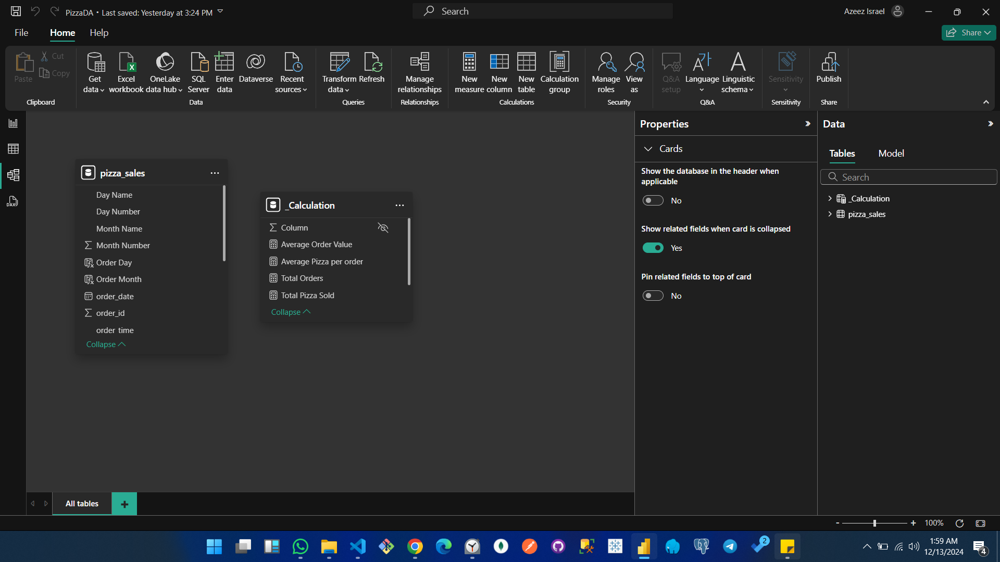
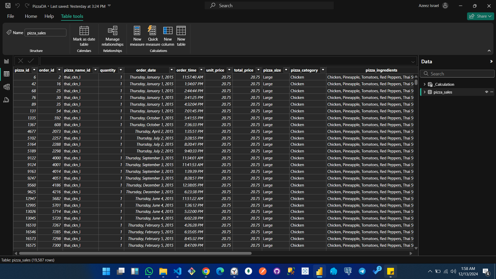
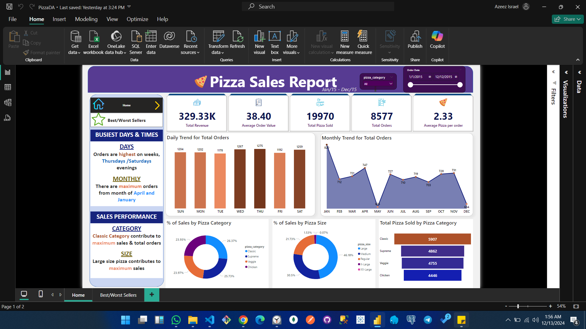
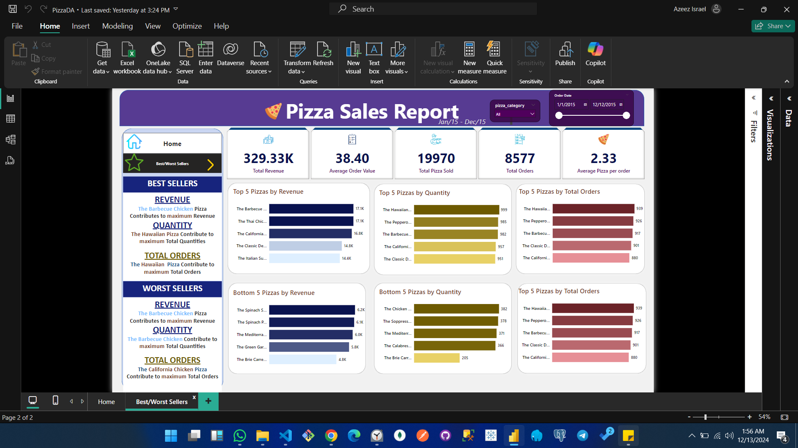

# Pizza Sales Data Analysis and Visualization

## Introduction
This project analyzes pizza sales data using SQL for initial exploration and Power BI for visualization. The analysis aims to uncover key insights about sales performance, customer preferences, and trends to assist in data-driven decision-making for the business.

---

## About the Data
The dataset contains information on pizza sales, including order dates, pizza categories, quantities sold, sizes, and revenues. The data spans a range of months, offering insights into customer preferences, peak sales periods, and performance by product categories.

Key columns in the dataset:
- `order_date`: Date of the order
- `pizza_name`: Name of the pizza
- `pizza_category`: Category (e.g., Classic, Veggie, Chicken)
- `pizza_size`: Size (e.g., Small, Medium, Large)
- `quantity`: Number of pizzas sold
- `revenue`: Total revenue generated

---

## Methodology

### Data Collection
The data was extracted from a hypothetical sales database. SQL queries were used to aggregate data for analysis.

### Data Cleaning & Transformation
- Missing and inconsistent values were addressed.
- Date columns were formatted, and sales metrics were aggregated.
- Additional columns such as `Day Name`, `Month Name`, and `Pizza Per Order` were derived for enhanced analysis.

### Exploratory Data Analysis
SQL queries were used to:
- Identify best-selling pizzas by revenue and quantity.
- Understand trends in sales by day, week, and month.

### Visualization
The cleaned data was imported into Power BI to create interactive dashboards highlighting sales trends, pizza popularity, and peak order times.

### Statistical Analysis
Key statistical measures such as averages, totals, and proportions were calculated to understand sales performance.

### Interpretation & Recommendations
Insights were drawn from the analysis, leading to recommendations for marketing strategies, product optimization, and operational improvements.

---

## Data Structure
### Sample Structure
| Column          | Description                          |
|-----------------|--------------------------------------|
| `order_date`    | Date of the order                   |
| `pizza_name`    | Name of the pizza                   |
| `pizza_category`| Category of the pizza               |
| `pizza_size`    | Size of the pizza                   |
| `quantity`      | Quantity sold                       |
| `revenue`       | Revenue generated from the sale     |

### Image

---

## Data Model Overview
The data model consists of:
1. `pizza_sales` table containing transactional data.
2. Measures stored in a separate `_calculations` table to calculate dynamic insights such as:
   - Total Revenue
   - Average Order Value
   - Total Pizzas Sold
   - Top and Bottom Performers

---

## Analysis
The analysis focused on:
1. Identifying best and worst-performing pizzas based on revenue, quantity, and total orders.
2. Analyzing daily, weekly, and monthly sales trends.
3. Examining sales performance by pizza size and category.

---

## Dashboards
Two dashboards were created:
1. **Home Dashboard**: Focused on sales trends, performance by category, and customer preferences.

2. **Best/Worst Sellers Dashboard**: Showcased best and worst sellers based on various metrics.

---

## Insights
1. **Best Sellers**:
   - The Hawaiian pizza is the most popular by quantity and total orders.
   - The Barbecue Chicken pizza generates the highest revenue.

2. **Worst Sellers**:
   - The Brie pizza had the lowest sales across all metrics.

3. **Peak Times**:
   - Sales are highest on Thursdays and Saturdays during evening hours.
   - April and January saw the maximum number of orders.

4. **Performance by Size**:
   - Large pizzas contribute the most to revenue.

5. **Category Insights**:
   - Classic pizzas dominate in sales, followed by Supreme.

---

## Recommendations
1. **Promote Best Sellers**:
   - Increase marketing efforts for the Hawaiian and Barbecue Chicken pizzas.
   - Offer bundle deals featuring these pizzas.

2. **Improve Performance of Worst Sellers**:
   - Reevaluate pricing and marketing strategies for poorly performing pizzas like Brie.

3. **Maximize Peak Times**:
   - Introduce promotional campaigns on Thursdays and Saturdays to capitalize on peak demand.

4. **Focus on Large Sizes**:
   - Optimize inventory to cater to high demand for large pizzas.

5. **Category-Specific Campaigns**:
   - Develop targeted promotions for Classic and Supreme categories.

---

## Conclusion
The analysis and visualizations provide actionable insights into customer preferences and sales trends. Implementing the recommendations can help optimize revenue, improve product performance, and enhance customer satisfaction.
